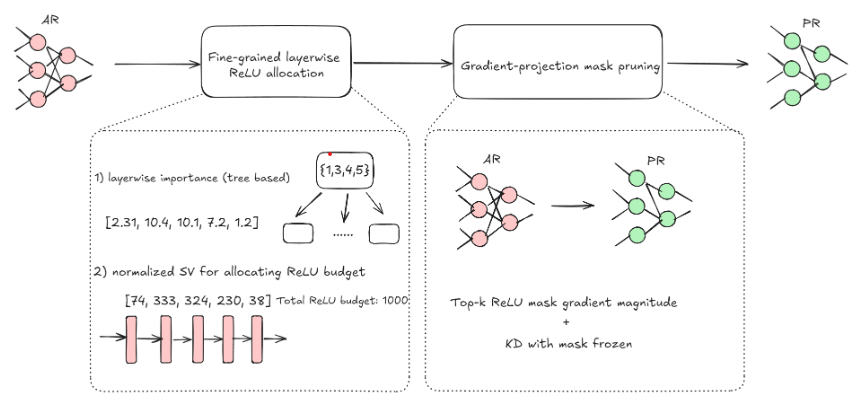

# PrivShap: a finer-grained Network linearization for private inference





### Setup

Basic Requirements:

1. pytorch == 1.1.0
2. torchvision == 0.12.0
3. numpy == 1.21.5

### Instructions
Quick start for ResNet18 on CIFAR100. Adjust scripts and flags as needed.

1. Train the base ResNet18 model: 
```
bash ./scripts/train_resnet18_c100.sh
```
2. Test the Shapley values of the base ResNet18 model:
```
bash ./scripts/layer_shapley.sh
```
3. Baseline and PrivShap KD training:
```
bash ./scripts/resnet18_c100_relu_30k.sh
```

4. Unstructured finetuning for different baseline (choose type):

Option A — use the provided script and set `TYPE`:
```
# Edit the script to set baseline
#   TYPE=senet      # gradient-based layer importance
#   TYPE=privshap   # Shapley-based layer importance

bash ./scripts/resnet18_c100_relu_30k.sh
```

Option B — run directly with the `--type` flag:
```
# Example: privshap variant
CUDA_VISIBLE_DEVICES=0 \
python3 privshap_unstructured_projected.py \
  cifar100 resnet18_in ./output/cifar100/400000/resnet18_in/ \
  ./pretrained_models/cifar100/resnet18_in/best_checkpoint.pth.tar \
  --relu_budget 400000 --alpha 1e-5 --lr 1e-3 --threshold 1e-5 \
  --batch 128 --logname resnet18_in_unstructured_400000.txt \
  --finetune_epochs 100 --type privshap
```

### Baselines

- `senet`: Allocates per-layer budgets using gradient magnitudes (layer-wise normalised).
- `privshap`: Allocates per-layer budgets using layer Shapley values computed via `layer_shapley_refactored.py`.

Both variants produce a per-layer budget list that is used to project gradients to binary masks deterministically.

### Outputs and Logs

- Checkpoints and logs are written under `./snl_output/<dataset>/<relu_budget>/<arch>/` by default.
- The finetune script logs hyperparameters, including `Type`, in the run log file (e.g., `resnet18_in_unstructured_400000.txt`).
- Layer Shapley analysis saves a text report specified by `--logname` in the chosen `outdir`.

### Citation

If you find PrivShap useful in your research, please cite it:

```
@article{xu2025privshap,
  title={PrivShap: A Finer-granularity Network Linearization Method for Private Inference},
  author={Xu, Xiangrui and Wang, Zhenzhen and Ning, Rui and Xin, Chunsheng and Wu, Hongyi},
  journal={Transactions on Machine Learning Research},
  year={2025}
}
```


